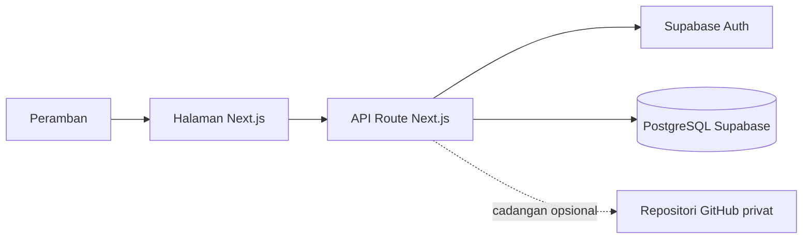

# Buku Piutang

Buku Piutang adalah aplikasi pencatatan piutang toko berbasis web. Aplikasi ini membantu pemilik toko mengelola pelanggan, membuat nota piutang berisi beberapa barang, menerima pembayaran, menyimpan saldo kelebihan bayar, membagikan rincian melalui WhatsApp, dan mencadangkan data.

Antarmuka tersedia dalam mode terang dan gelap, serta dirancang untuk layar komputer dan ponsel. Data setiap akun dipisahkan di Supabase menggunakan Row Level Security (RLS).

## Fitur utama

- **Daftar pelanggan** — tambah, ubah, cari, filter, urutkan, dan hapus pelanggan beserta nomor WhatsApp-nya.
- **Nota piutang beberapa barang** — satu nota dapat berisi 1–50 barang dengan nomor nota yang dibuat otomatis berdasarkan tanggal.
- **Harga eceran dan grosir** — total grosir menggunakan rumus `jumlah × harga eceran − diskon`; perubahan total grosir dan diskon saling disinkronkan.
- **Pembayaran fleksibel** — menerima pembayaran sebagian atau pelunasan seluruh piutang, lalu mengalokasikannya mulai dari piutang paling lama.
- **Saldo kelebihan bayar** — kelebihan uang dapat disimpan sebagai saldo pelanggan dan digunakan pada pembayaran berikutnya.
- **Riwayat pelanggan** — tab Buku Piutang, Pembayaran, dan Profil dengan filter tanggal, nominal, dan status piutang.
- **Tindakan massal** — hapus beberapa transaksi piutang yang tidak valid sekaligus.
- **Berbagi rincian** — salin pesan atau buka WhatsApp dengan pilihan Santai & informatif, Struk tagihan, dan Pengingat ramah.
- **Pengaturan isi pesan** — pilih apakah nama toko, alamat, nomor nota, dan nama pelanggan ditampilkan.
- **Grafik tren** — menampilkan piutang dan pembayaran bulan berjalan serta delapan pelanggan dengan transaksi piutang terbanyak.
- **Informasi toko dan kasir** — simpan identitas toko, kelola kasir, dan aktifkan atau nonaktifkan kasir.
- **Cadangan data** — unduh dan pulihkan JSON dari perangkat atau simpan maksimal tiga cadangan terbaru pada repositori GitHub privat.
- **Autentikasi** — halaman utama dan pengaturan hanya dapat dibuka oleh pengguna Supabase yang sudah masuk.

## Teknologi

| Bagian | Teknologi |
| --- | --- |
| Kerangka aplikasi | Next.js 16 dengan App Router |
| Antarmuka | React 19, TypeScript, Tailwind CSS 4, komponen shadcn/ui |
| Basis data dan autentikasi | Supabase (PostgreSQL, Auth, RLS, RPC) |
| Grafik | Recharts |
| Tema | next-themes |
| Ikon | Lucide React |
| Pemberitahuan | Sonner |
| Hosting utama | Vercel |
| Cadangan jarak jauh | GitHub Contents API |

## Arsitektur ringkas



Semua operasi data dilakukan dalam konteks pengguna yang sedang masuk. Tabel memakai `owner_id`, kebijakan RLS membatasi akses ke `auth.uid()`, dan operasi transaksi yang memerlukan konsistensi dijalankan melalui fungsi PostgreSQL.

## Persyaratan

- Node.js `>=22.13.0`
- npm
- Proyek Supabase
- Akun pengguna di Supabase Auth
- Repositori GitHub privat dan token akses jika fitur cadangan GitHub digunakan
- Akun Vercel jika aplikasi akan diterapkan ke internet

## Menjalankan secara lokal

1. Klon repositori dan masuk ke folder proyek.

   ```bash
   git clone https://github.com/tirsasaki/bukuhutang-v2.git
   cd bukuhutang-v2
   ```

2. Pasang dependensi sesuai berkas kunci.

   ```bash
   npm ci
   ```

3. Salin contoh variabel lingkungan.

   ```bash
   cp .env.example .env.local
   ```

4. Isi URL dan anon key Supabase di `.env.local`.

5. Buka **SQL Editor** pada Supabase, lalu jalankan seluruh isi [`supabase/schema.sql`](supabase/schema.sql). Berkas ini sudah menggambarkan skema terbaru untuk pemasangan baru.

6. Buka **Authentication → Users** di Supabase dan buat akun pengguna dengan email serta kata sandi. Aplikasi tidak menyediakan halaman pendaftaran pengguna.

7. Jalankan aplikasi.

   ```bash
   npm run dev
   ```

8. Buka [http://localhost:3000](http://localhost:3000), lalu masuk menggunakan akun Supabase yang telah dibuat.

## Variabel lingkungan

| Nama | Wajib | Keterangan |
| --- | --- | --- |
| `NEXT_PUBLIC_SUPABASE_URL` | Ya | URL proyek Supabase. |
| `NEXT_PUBLIC_SUPABASE_ANON_KEY` | Ya | Anon public key Supabase. Keamanan data tetap dijaga oleh autentikasi dan RLS. |
| `GITHUB_BACKUP_TOKEN` | Tidak | Fine-grained personal access token untuk cadangan GitHub. Simpan hanya di lingkungan server. |
| `GITHUB_BACKUP_REPOSITORY` | Tidak | Repositori tujuan dalam format `pemilik/repositori`. Nilai bawaan kode adalah `tirsasaki/bukuhutang-backup`; tetapkan secara eksplisit pada instalasi lain. |
| `GITHUB_BACKUP_BRANCH` | Tidak | Cabang repositori cadangan. Nilai bawaan: `main`. |

Contoh tersedia di [`.env.example`](.env.example). Jangan menyimpan token atau nilai rahasia asli ke Git.

### Menyiapkan cadangan GitHub

1. Buat repositori privat khusus cadangan.
2. Buat fine-grained personal access token yang hanya dapat mengakses repositori tersebut.
3. Berikan izin **Contents: Read and write**.
4. Isi tiga variabel `GITHUB_BACKUP_*` pada `.env.local` atau pengaturan lingkungan Vercel.

Cadangan disimpan di `backups/{id-pengguna}/`. Aplikasi menampilkan dan mempertahankan maksimal tiga cadangan terbaru; cadangan yang lebih lama dihapus ketika cadangan baru dibuat. Berkas cadangan dibatasi hingga 5 MB.

## Basis data Supabase

Skema utama terdiri dari:

| Tabel | Kegunaan |
| --- | --- |
| `customers` | Identitas pelanggan dan nomor WhatsApp. |
| `invoice_counters` | Nomor urut nota per pengguna dan tanggal. |
| `invoices` | Kepala nota, kasir, tanggal, dan total. |
| `debt_items` | Barang atau rincian piutang pada nota. |
| `payments` | Alokasi pembayaran tunai atau saldo ke setiap piutang. |
| `credit_transactions` | Perubahan saldo kelebihan bayar pelanggan. |
| `cashiers` | Data kasir dan status aktif. |
| `store_settings` | Nama serta alamat toko. |
| `import_batches` | Sidik jari impor untuk mencegah pemulihan berkas yang sama berulang kali. |

Fungsi PostgreSQL yang digunakan aplikasi:

- `create_debt_invoice` membuat nomor nota, kepala nota, dan seluruh barang secara atomik.
- `record_customer_payment_v2` mengalokasikan pembayaran, memakai saldo jika diminta, dan menyimpan kelebihan pembayaran.
- `record_customer_payment` dan `settle_customer_debts` dipertahankan untuk kompatibilitas alur sebelumnya.

### Pemasangan baru dan pembaruan skema

- **Pemasangan baru:** jalankan [`supabase/schema.sql`](supabase/schema.sql) saja.
- **Basis data lama:** jalankan berkas baru dalam [`supabase/migrations`](supabase/migrations) sesuai urutan berikut dan lewati migrasi yang sudah pernah diterapkan.

Migrasi yang tersedia saat ini:

1. `20260917_add_cashiers.sql`
2. `20260917_add_multi_item_invoices.sql`
3. `20260917_fix_invoice_date_ambiguity.sql`
4. `20260917_add_payment_options.sql`
5. `20260917_add_overpayment_credit.sql`
6. `20260917_add_store_settings.sql`
7. `20260918_add_item_discounts.sql`
8. `20260919_sync_wholesale_total_and_discount.sql`

Urutan penerapan yang sudah dipakai pada instalasi lama tercatat lebih rinci di [`DEPLOY_VERCEL.md`](DEPLOY_VERCEL.md). Jangan menjalankan ulang migrasi yang sudah diterapkan.

## Cadangan dan pemulihan

Cadangan memakai format JSON `bukuhutang-v2` versi 2 dan mencakup pelanggan, penghitung nota, nota, rincian piutang, pembayaran, transaksi saldo, kasir, serta informasi toko.

Pilihan yang tersedia pada **Pengaturan Toko → Cadangan data**:

- **Unduh ke perangkat** untuk menyimpan salinan JSON secara lokal.
- **Simpan ke GitHub** untuk membuat cadangan pada repositori privat.
- **Pulihkan dari GitHub** untuk mengambil salah satu dari tiga cadangan terbaru.
- **Pulihkan dari perangkat** untuk memilih satu atau beberapa berkas JSON.

Saat memulihkan data, baris transaksi yang sudah ada dilewati berdasarkan identitasnya, sedangkan informasi toko diperbarui. Aplikasi menghitung SHA-256 berkas dan mencatatnya pada `import_batches`, sehingga berkas yang sama tidak diimpor dua kali.

## Alur penggunaan

1. Masuk menggunakan akun Supabase.
2. Buka **Pengaturan Toko**, isi nama serta alamat toko, lalu tambahkan kasir aktif.
3. Tambahkan pelanggan dan nomor WhatsApp.
4. Pilih pelanggan, kemudian tekan **Catat piutang**.
5. Isi tanggal, kasir, barang, jumlah, harga, mode harga, dan diskon jika memakai harga grosir.
6. Gunakan **Catat pembayaran** untuk pembayaran sebagian atau pelunasan.
7. Buka **Bagikan rincian** untuk menyalin pesan atau membuka WhatsApp.
8. Buat cadangan secara berkala melalui halaman Pengaturan.

## API aplikasi

| Jalur | Metode | Fungsi |
| --- | --- | --- |
| `/api/ledger` | `GET`, `POST` | Membaca buku piutang serta mengelola pelanggan, piutang, pembayaran, dan penghapusan massal. |
| `/api/cashiers` | `GET`, `POST` | Membaca dan mengelola kasir. |
| `/api/store` | `GET`, `POST` | Membaca dan menyimpan informasi toko. |
| `/api/backup` | `GET` | Mengunduh cadangan JSON. |
| `/api/import` | `POST` | Memulihkan cadangan JSON. |
| `/api/github-backups` | `GET`, `POST` | Melihat, membuat, dan membaca cadangan GitHub. |

Semua jalur API membutuhkan sesi Supabase yang valid.

## Perintah pengembangan

| Perintah | Kegunaan |
| --- | --- |
| `npm run dev` | Menjalankan server pengembangan Next.js. |
| `npm run lint` | Memeriksa kode dengan ESLint. |
| `npx tsc --noEmit` | Memeriksa tipe TypeScript tanpa membuat berkas keluaran. |
| `npm run build` | Memeriksa tipe lalu membuat versi produksi dengan Next.js. |
| `npm start` | Menjalankan versi produksi yang sudah dibuat. |

Sebelum membuat PR, jalankan setidaknya:

```bash
npm run lint
npx tsc --noEmit
npm run build
```

## Penerapan ke Vercel

1. Impor repositori ini ke Vercel.
2. Tambahkan `NEXT_PUBLIC_SUPABASE_URL` dan `NEXT_PUBLIC_SUPABASE_ANON_KEY` untuk Production dan Preview.
3. Tambahkan variabel `GITHUB_BACKUP_*` jika cadangan GitHub digunakan.
4. Terapkan ulang aplikasi setelah variabel disimpan.
5. Pastikan URL penerapan dapat membuka halaman masuk dan data hanya terlihat setelah autentikasi.

Panduan langkah demi langkah tersedia di [`DEPLOY_VERCEL.md`](DEPLOY_VERCEL.md).

## Struktur proyek

```text
app/
├── api/                 # Jalur API buku piutang, pengaturan, dan cadangan
├── login/               # Halaman masuk Supabase
├── pengaturan/          # Informasi toko, kasir, dan cadangan
├── globals.css          # Tema terang/gelap dan Tailwind CSS
└── page.tsx             # Halaman utama buku piutang
components/
├── ledger/              # Daftar pelanggan, detail, transaksi, grafik, dan dialog
├── settings/            # Antarmuka cadangan data
└── ui/                  # Komponen antarmuka shadcn/ui
hooks/                   # Pengambilan data dan integrasi alat opsional
lib/
├── backup/              # Pembuatan serta penyimpanan cadangan
├── ledger/              # Pembacaan, format, tipe, dan pesan berbagi
└── supabase/            # Klien Supabase peramban dan server
supabase/
├── migrations/          # Perubahan bertahap untuk basis data lama
└── schema.sql           # Skema lengkap untuk pemasangan baru
```

Folder `examples/d1` dan berkas `.openai/hosting.json` berasal dari dukungan hosting OpenAI yang bersifat opsional. Alur data utama aplikasi saat ini menggunakan Supabase; penerapan utama didokumentasikan untuk Vercel.

## Keamanan

- Jangan pernah memasukkan `.env.local`, token GitHub, kata sandi, atau kunci rahasia ke repositori.
- `NEXT_PUBLIC_SUPABASE_ANON_KEY` memang digunakan di sisi peramban dan bukan service role key.
- Seluruh tabel utama mengaktifkan RLS dan membatasi data berdasarkan `owner_id = auth.uid()`.
- Token cadangan GitHub hanya dibaca oleh kode server dan sebaiknya dibatasi pada satu repositori privat.
- Aplikasi tidak menyediakan pendaftaran publik. Kelola pengguna melalui dasbor Supabase atau alur administrasi terpisah.

Cara melaporkan kerentanan dan aturan pengujian yang aman dijelaskan dalam [`SECURITY.md`](SECURITY.md). Jangan menuliskan rincian kerentanan atau rahasia pada issue publik.

## Lisensi

Proyek ini tersedia dengan [MIT License](LICENSE). Anda dapat menggunakan, menyalin, mengubah, menggabungkan, menerbitkan, mendistribusikan, mensublisensikan, atau menjual salinan perangkat lunak sesuai ketentuan lisensi tersebut.
